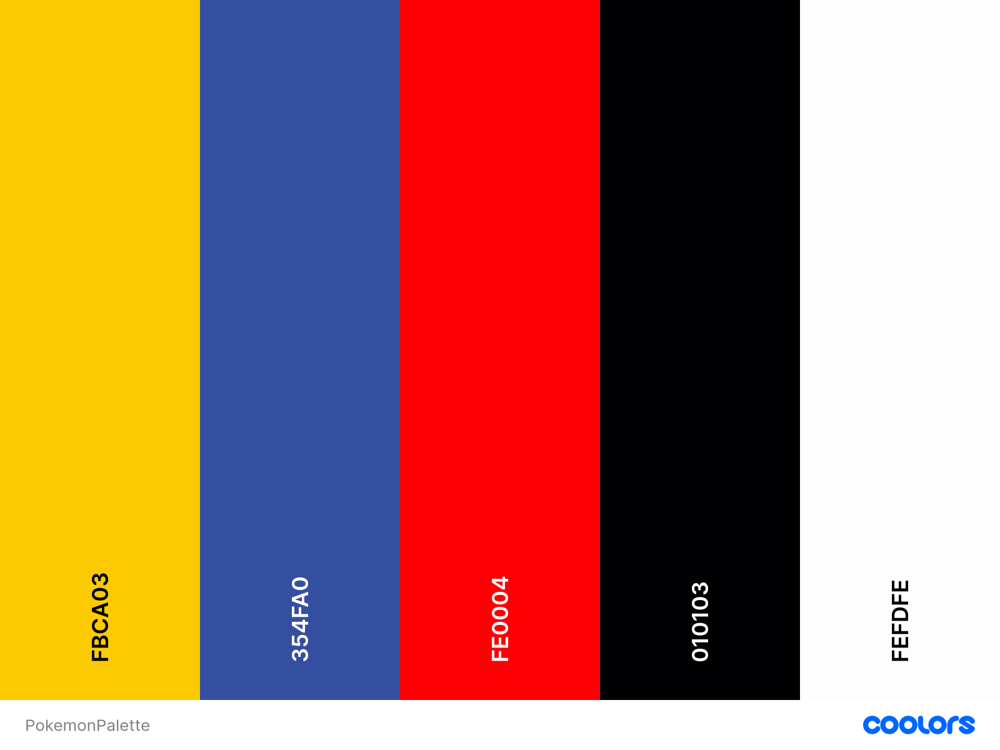
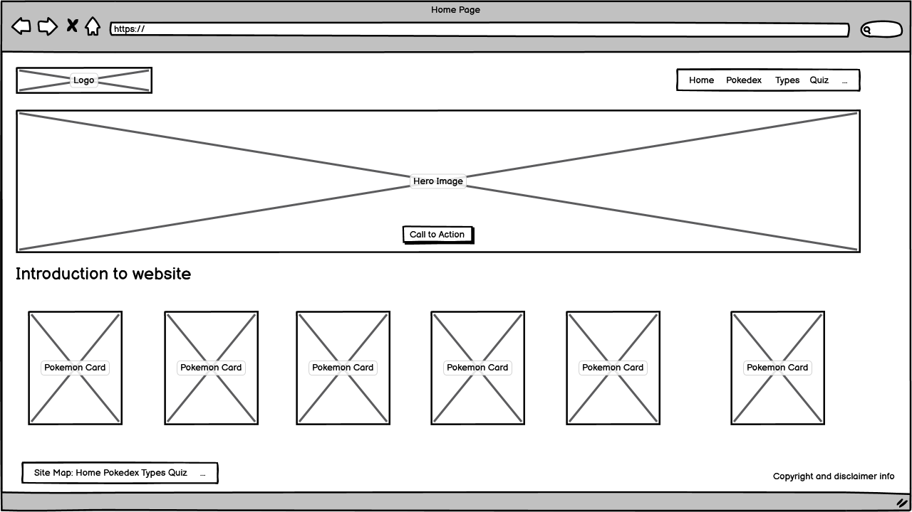

<h1 align="center">Milestone 1 Project: Pokemon World</h1>

[View the live project here.](https://mrsg33k.github.io/CI-MS1-Pokemon/index.html)

Welcome to Pokemon World - This 3 page website is designed to introduce you to the world of Pokemon whilst showcasing skills learnt in HTML, CSS and Bootstrap as part of the Code Institute Level 5 Diploma in Web Application Development. 

<h2 align="center"></h2>

## User Experience (UX)

-   ### User stories

    -   #### First Time Visitor Goals

        1. As a First Time Visitor, I want to easily understand the main purpose of the site and learn more about pokemon.
        2. As a First Time Visitor, I want a navigation menu that is easy to use  so that I can find the information I need quickly
        3. As a First Time Visitor, I want to read about different types of Pokemon so that I can understand their strengths and weaknesses

    -   #### Returning Visitor Goals

        1. As a Returning Visitor, I want to find new or updated content easily so that I can stay engaged with the website. 
        2. As a Returning Visitor, I want links to external Pokemon resources so that I can expand my knowledge. 


-   ### Design Reference
    -   #### Colour Scheme
        -    I have decided, for user familiarity to use colours associated with Pokemon. 
        - **Pokémon Blue Colour**: `#354FA0`
        - **Pokémon Yellow Colour**: `#FBCA03`
        - **Poké Ball Red Colour**: `#FE0004`
        - **Poké Ball Black Colour**: `#010103`
        - **Display Font**: [Press Start 2P](https://fonts.google.com/specimen/Press+Start+2P)
        - **Body Font**: [Quicksand](https://fonts.google.com/specimen/Quicksand)
        

    -   #### Typography
        - Quicksand font is the main body font used throughout website with Sans Serif being used as a backup font if the Quicksand font fails to load correctly. Quicksand is a modern, sans serif font which will be clear and easy to read on the screeen.
    -   #### Imagery
        -   Imagery is important. The large, background hero image is designed to be striking and catch the user's attention. It also has a modern, energetic aesthetic.

*   ### Wireframes
    - #### Homepage Wireframe
        - **Here are the wireframes for both desktop and mobile for the homepage:**
        <figure>
            
            <figcaption>Image of desktop wireframe for the homepage layout</figcaption>
        </figure>

        <figure>
            
            <figcaption>Image of mobile wireframe for the homepage layout</figcaption>
        </figure>
    
    - #### PokeTypes Wireframe
        - **I have also included a mock up of how the Poketypes page might look using an accordian to show the different Poketypes.**
        <figure>
            
            <figcaption>Image of desktop wireframe for the poketypes layout</figcaption>
        </figure>

        <figure>
            
            <figcaption>Image of mobile wireframe for the poketypes layout</figcaption>
        </figure>


## Features

- A simple and engaging introduction to Pokémon
- A visually appealing design with Pokémon-themed elements
- Easy-to-use navigation across all three pages
- Informative content for both beginners and returning fans
- A mobile first responsive design

### Languages Used

-   [HTML5](https://en.wikipedia.org/wiki/HTML5)
-   [CSS3](https://en.wikipedia.org/wiki/Cascading_Style_Sheets)

### Frameworks, Libraries & Programs Used

1. [Bootstrap 5:](https://getbootstrap.com/)
    - Bootstrap was used to assist with the responsiveness and styling of the website.
1. [Hover.css:](https://ianlunn.github.io/Hover/)
    - Hover.css was used on the Social Media icons in the footer to add the float transition while being hovered over.
1. [Google Fonts:](https://fonts.google.com/)
    - Google fonts were used to import the '[Press Start 2P](https://fonts.google.com/specimen/Press+Start+2P/)' and the '[Quicksand](https://fonts.google.com/specimen/Quicksand)' font into the style.css file which is used on all pages throughout the project.
1. [Font Awesome:](https://fontawesome.com/)
    - Font Awesome was used on all pages throughout the website to add icons for aesthetic and UX purposes.
1. [jQuery:](https://jquery.com/)
    - jQuery came with Bootstrap to make the navbar responsive but was also used for the smooth scroll function in JavaScript.
1. [Git](https://git-scm.com/)
    - Git was used for version control by utilizing the Gitpod terminal to commit to Git and Push to GitHub.
1. [GitHub:](https://github.com/)
    - GitHub is used to store the projects code after being pushed from Git.
1. [Canva:](https://www.canva.com)
    - Canva was used to create and edit the header image and the logo for the website. 
1. [Google Gemini:](https://gemini.google.com)
    - The [Imagen 3](https://deepmind.google/technologies/imagen-3/) image generation was used to create concept images for the logo and some of the Pokemon
1. [Balsamiq:](https://balsamiq.com/)
    - Balsamiq was used to create the [wireframes](https://github.com/) during the design process.

## Testing

The W3C Markup Validator and W3C CSS Validator Services were used to validate every page of the project to ensure there were no syntax errors in the project.

-   [W3C Markup Validator](https://validator.w3.org/) - [Results](https://validator.w3.org/nu/?showsource=yes&showoutline=yes&showimagereport=yes&doc=https%3A%2F%2Fmrsg33k.github.io%2FCI-MS1-Pokemon%2Findex.html)
-   [W3C CSS Validator](https://jigsaw.w3.org/css-validator/#validate_by_input) - [Results](https://jigsaw.w3.org/css-validator/validator?lang=en&profile=css3svg&uri=https%3A%2F%2Fmrsg33k.github.io%2FCI-MS1-Pokemon%2Findex.html&usermedium=all&vextwarning=&warning=1)


### Testing User Stories from User Experience (UX) Section

-   #### First Time Visitor Goals

        1. As a First Time Visitor, I want to easily understand the main purpose of the site and learn more about pokemon.
        2. As a First Time Visitor, I want a navigation menu that is easy to use  so that I can find the information I need quickly
        3. As a First Time Visitor, I want to read about different types of Pokemon so that I can understand their strengths and weaknesses


-   #### Returning Visitor Goals

        1. As a Returning Visitor, I want to find new or updated content easily so that I can stay engaged with the website. 
        2. As a Returning Visitor, I want links to external Pokemon resources so that I can expand my knowledge. 


### Further Testing


### Known Bugs


## Deployment

### GitHub Pages

The project was deployed to GitHub Pages using the following steps...

1. Log in to GitHub and locate the [GitHub Repository](https://github.com/)
2. At the top of the Repository (not top of page), locate the "Settings" Button on the menu.
    - Alternatively Click [Here](https://raw.githubusercontent.com/) for a GIF demonstrating the process starting from Step 2.
3. Scroll down the Settings page until you locate the "GitHub Pages" Section.
4. Under "Source", click the dropdown called "None" and select "Master Branch".
5. The page will automatically refresh.
6. Scroll back down through the page to locate the now published site [link](https://github.com) in the "GitHub Pages" section.

### Forking the GitHub Repository

By forking the GitHub Repository we make a copy of the original repository on our GitHub account to view and/or make changes without affecting the original repository by using the following steps...

1. Log in to GitHub and locate the [GitHub Repository](https://github.com/)
2. At the top of the Repository (not top of page) just above the "Settings" Button on the menu, locate the "Fork" Button.
3. You should now have a copy of the original repository in your GitHub account.

### Making a Local Clone

1. Log in to GitHub and locate the [GitHub Repository](https://github.com/)
2. Under the repository name, click "Clone or download".
3. To clone the repository using HTTPS, under "Clone with HTTPS", copy the link.
4. Open Git Bash
5. Change the current working directory to the location where you want the cloned directory to be made.
6. Type `git clone`, and then paste the URL you copied in Step 3.

```
$ git clone https://github.com/YOUR-USERNAME/YOUR-REPOSITORY
```

7. Press Enter. Your local clone will be created.

```
$ git clone https://github.com/YOUR-USERNAME/YOUR-REPOSITORY
> Cloning into `CI-Clone`...
> remote: Counting objects: 10, done.
> remote: Compressing objects: 100% (8/8), done.
> remove: Total 10 (delta 1), reused 10 (delta 1)
> Unpacking objects: 100% (10/10), done.
```

Click [Here](https://help.github.com/en/github/creating-cloning-and-archiving-repositories/cloning-a-repository#cloning-a-repository-to-github-desktop) to retrieve pictures for some of the buttons and more detailed explanations of the above process.

## Credits
- [Joaquin Corbalan - stock.adobe.com](https://stock.adobe.com/): Valencia, Spain - May 10, 2019: Pokemon Trading Card Game, fondness for the collectibles of children of all ages, fans of the Pokemon RPGs. Image used in the carousel background
- [Merijar - stock.adobe.com](https://stock.adobe.com): Granada, Spain; March 4, 2023: Pokemon Funko Pop Vinyl Figures: Pikachu, Charmander, Bulbasaur, Squirtle. Image used in the carousel background for the quiz
- [selugallego - stock.adobe.com](https://stock.adobe.com): Background created with collectible Pokemon cards. Image used in the carousel background for the Poketypes
- [Bennphoto - stock.adobe.com](https://stock.adobe.com):Vibrant Pokémon energy cards stacked together from the popular Japanese franchise. Image used in the carousel for the Poketypes. 
- [PokeAPI - pokeapi.co](https://pokeapi.co/): API to access sprite images for the Pokedex as well as all the statistics for the Pokedex Page
- [Bulbapedia - bulbgarden.net](https://bulbapedia.bulbagarden.net/wiki/Main_Page): For additional Pokemon information for the Pokedex and Types 
- [Game Rant - gamerant.com](https://gamerant.com/pokemon-pokedex-each-region-fan-recreates/): Image of the Pokedex
- [Monster Wiki - monster-master.fandom.com](https://monster-master.fandom.com/wiki/Pokemon_Type): Image of Pokemon Types
- [Baby Pokemon Wiki -pokewiki.de ](https://www.pokewiki.de/Baby-Pok%C3%A9mon): Image of Group pokemon for Quiz page

### Code

- [Bootstrap5](https://getbootstrap.com/docs/5.3/getting-started/introduction/): Bootstrap library documentation referenced throughout to support with the responsiveness of the site and to tweak the cards on the Pokedex.

- [W3 Schools](https://www.w3schools.com/css/) : For help when changing the NavBar colour to override the Bootstrap default. Helping with the CSS Hover transform effects. 

- [Josh W Comeau](https://www.joshwcomeau.com/css/custom-css-reset/): Custom CSS Reset code used in the styling. 

### Content

-   All other content was created and written by me, Jennie Whittaker, the developer

### Acknowledgements

-   Mike Whittaker - For his help and feedback during the design process
-   Rachel Furlong - EKC Tutor for the course for her encouragement along the way. 
